# Python Brain NotebookLM

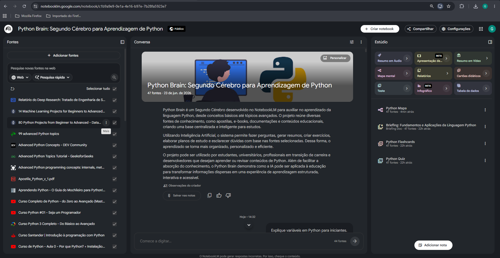

## Sobre o Projeto

Este projeto foi desenvolvido como parte do desafio da DIO utilizando o Google NotebookLM como ferramenta de aprendizagem ativa.

A proposta consiste na criação de um "Segundo Cérebro" focado no estudo da linguagem Python, reunindo materiais de referência, documentação, exercícios, planos de estudo, glossários e recursos de revisão em um único ambiente apoiado por Inteligência Artificial.

O NotebookLM foi utilizado para organizar fontes de estudo, gerar resumos, criar exercícios, construir planos de aprendizagem, elaborar mapas mentais e auxiliar na compreensão de conceitos fundamentais da programação em Python.

---

# Objetivos

- Centralizar materiais de estudo sobre Python.
- Utilizar Inteligência Artificial como ferramenta de apoio ao aprendizado.
- Desenvolver habilidades de Engenharia de Prompts.
- Criar materiais reutilizáveis para revisão e estudo.
- Organizar conhecimento técnico de forma estruturada.
- Explorar o NotebookLM como ferramenta de aprendizagem ativa.

---

# NotebookLM Utilizado

Durante o desenvolvimento deste projeto foi utilizado o Google NotebookLM como plataforma principal para organização do conhecimento, análise das fontes e geração de materiais de estudo.

### Acesso ao Notebook

🔗 https://notebooklm.google.com/notebook/c1b9a9e9-0e1a-4e16-b97e-7b28fa5923e7

Neste notebook é possível visualizar:

- Fontes utilizadas
- Resumos gerados
- Mapa mental
- Exercícios
- Plano de estudos
- Glossário
- Testes realizados
- Recursos de revisão

---

# Curadoria de Fontes

Para alimentar o NotebookLM foram utilizadas fontes abertas relacionadas ao ensino da linguagem Python.

## Fontes Utilizadas

- Apostila Python v1
- Introdução ao Python (IFRN)
- E-Book Python Avançado
- O Guia do Mochileiro Python
- Python do Zero à Programação Orientada a Objetos
- Código Limpo Completo
- Materiais complementares encontrados na web

Todas as fontes encontram-se organizadas na pasta:

```text
/fontes
```

---

# Engenharia de Prompts

Durante o projeto foram realizados diversos testes para avaliar a capacidade do NotebookLM em auxiliar no aprendizado da linguagem Python.

## Teste 1 — Explicação de Conceitos

### Prompt

```text
Explique variáveis em Python para iniciantes.
```

### Objetivo

Obter uma explicação simples e didática sobre variáveis.

### Resultado

O NotebookLM apresentou uma explicação clara, objetiva e adequada para estudantes iniciantes.

---

## Teste 2 — Plano de Estudos

### Prompt

```text
Monte um plano de estudos de Python para 30 dias.
```

### Objetivo

Criar uma trilha de aprendizado estruturada.

### Resultado

Foi gerado um cronograma progressivo contendo fundamentos, prática e projeto final.

---

## Teste 3 — Exercícios

### Prompt

```text
Crie 10 exercícios sobre listas em Python.
```

### Objetivo

Praticar estruturas de dados.

### Resultado

Foram gerados exercícios com diferentes níveis de dificuldade.

---

## Teste 4 — Entrevista Técnica

### Prompt

```text
Simule uma entrevista técnica para desenvolvedor Python júnior.
```

### Objetivo

Preparação para entrevistas de emprego.

### Resultado

Foram produzidas perguntas semelhantes às utilizadas em processos seletivos reais.

---

## Teste 5 — Correção de Código

### Prompt

```text
Analise o código abaixo, identifique os erros e apresente uma solução.
```

### Objetivo

Avaliar a capacidade da IA em identificar e corrigir erros de programação.

### Resultado

Os erros foram identificados corretamente e uma solução funcional foi apresentada.

---

# Cicatrizes (Refinamento de Prompts)

Durante os testes foi possível perceber que prompts genéricos produziam respostas menos completas.

A partir disso, foram realizados refinamentos para obter resultados mais precisos.

## Cicatriz 1

### Prompt Inicial

```text
Explique funções.
```

### Problema

Resposta muito genérica.

### Prompt Refinado

```text
Explique funções em Python para iniciantes utilizando exemplos do dia a dia e código comentado.
```

### Resultado

Resposta mais detalhada e didática.

---

## Cicatriz 2

### Prompt Inicial

```text
Crie exercícios de Python.
```

### Problema

Não especificava dificuldade ou conteúdo.

### Prompt Refinado

```text
Crie 10 exercícios sobre funções em Python divididos em níveis fácil, médio e difícil.
```

### Resultado

Exercícios mais organizados e úteis.

---

## Cicatriz 3

### Prompt Inicial

```text
Monte um plano de estudos.
```

### Problema

Plano muito amplo e genérico.

### Prompt Refinado

```text
Monte um plano de estudos de Python para 30 dias considerando 1 hora de estudo por dia.
```

### Resultado

Plano mais realista e adequado ao perfil do estudante.

---

# Materiais Gerados pelo NotebookLM

Os materiais produzidos durante o projeto encontram-se na pasta:

```text
/docs
```

## Conteúdo Disponível

- Glossário Python
- Plano de Estudos de 30 Dias
- Quiz com 20 Perguntas
- Engenharia de Prompts

---

# Principais Conceitos Aprendidos

## Fundamentos

- Variáveis
- Tipagem Dinâmica
- Tipagem Forte
- Operadores
- Entrada e Saída de Dados

## Estruturas de Controle

- if
- elif
- else
- for
- while
- break
- continue

## Estruturas de Dados

- Listas
- Tuplas
- Dicionários
- Conjuntos

## Funções

- Definição de Funções
- Parâmetros
- Retorno
- Modularização

## Programação Orientada a Objetos

- Classes
- Objetos
- Métodos
- Herança
- Encapsulamento

## Tratamento de Erros

- try
- except
- Exception
- Traceback

---

# Evidências do Projeto

## Tela Inicial do NotebookLM


---

## Fontes Utilizadas

### Fonte 1

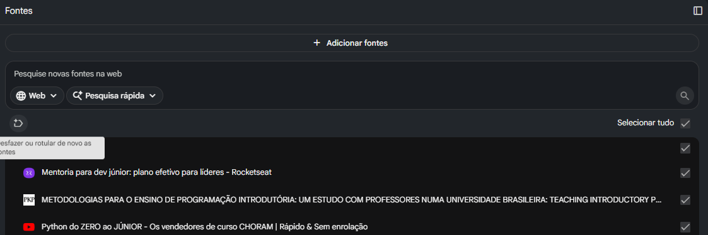

### Fonte 2

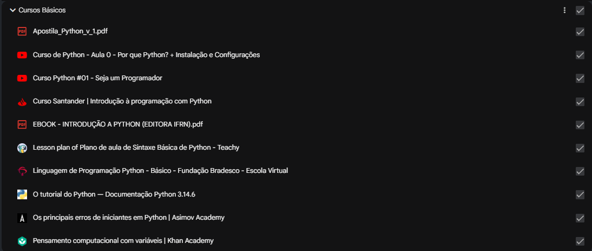

### Fonte 3

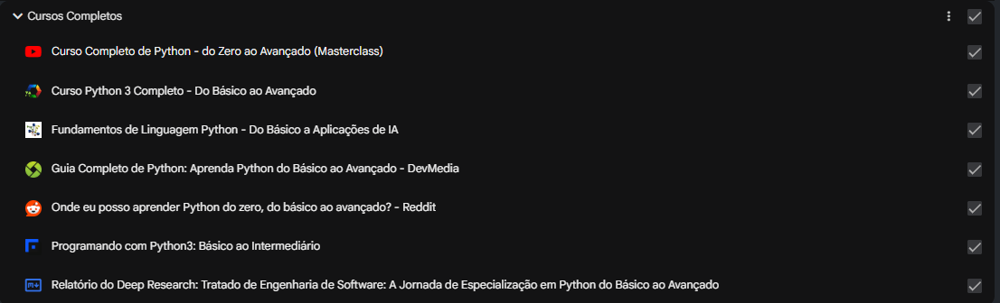

### Fonte 4

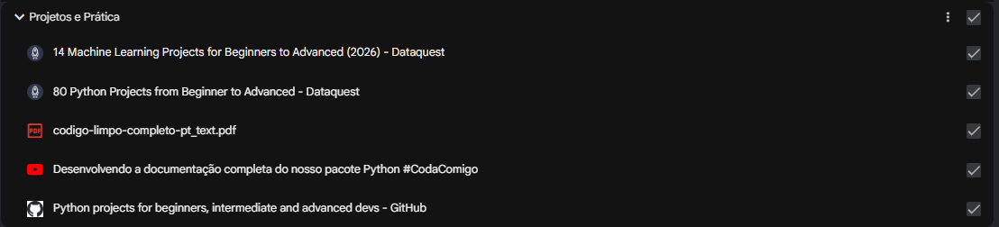

### Fonte 5

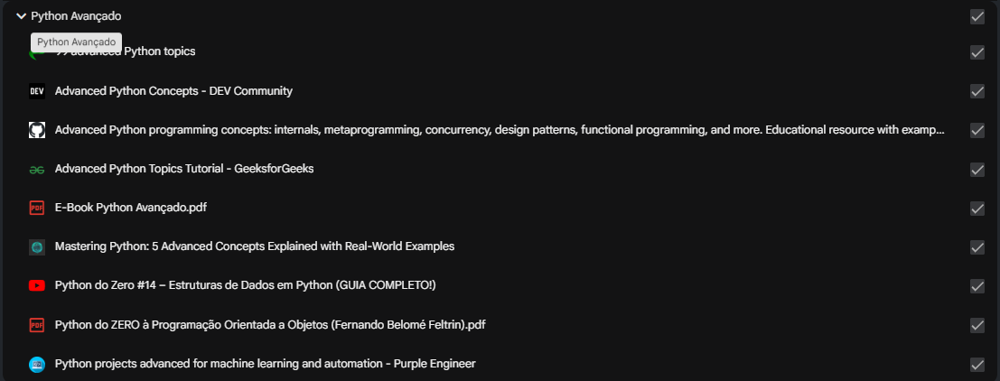

### Fonte 6

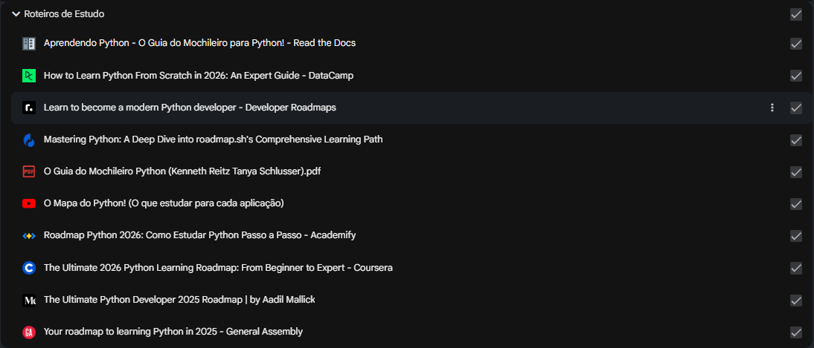

---

## Mapa Mental Gerado

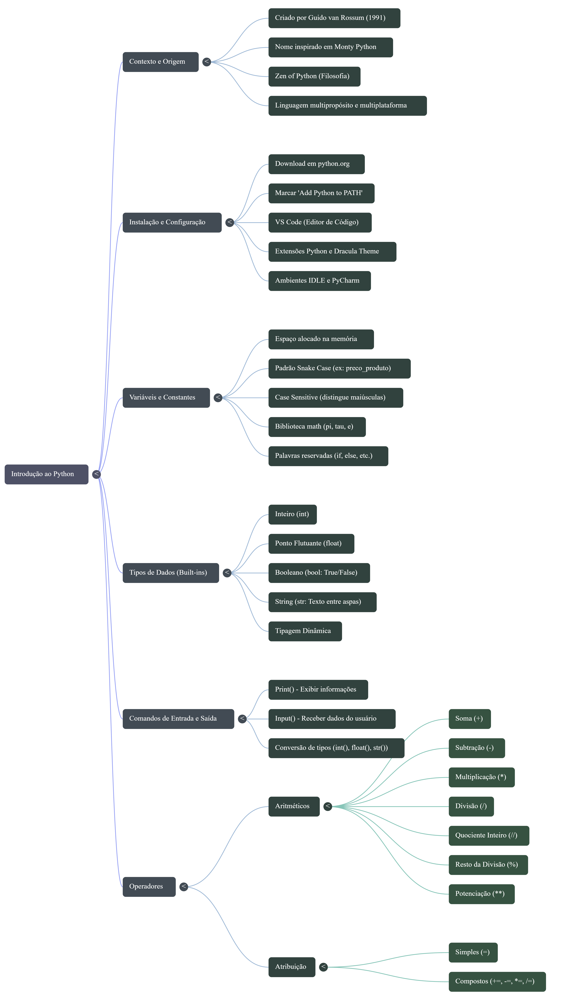

---

## Teste de Correção de Código

### Código com Erro

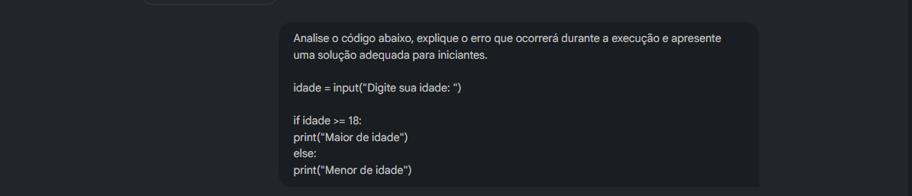

### Resposta Gerada pela IA

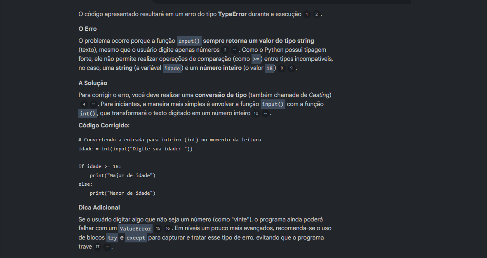

---

## Testes Realizados

### Teste de Conceitos e Plano de Estudos

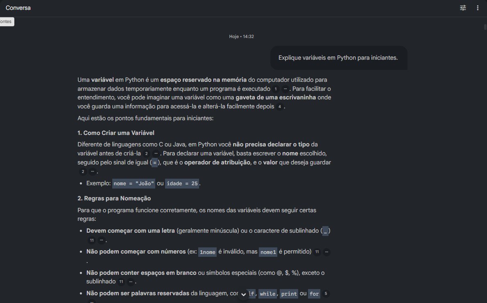

### Teste de Exercícios e Entrevista Técnica

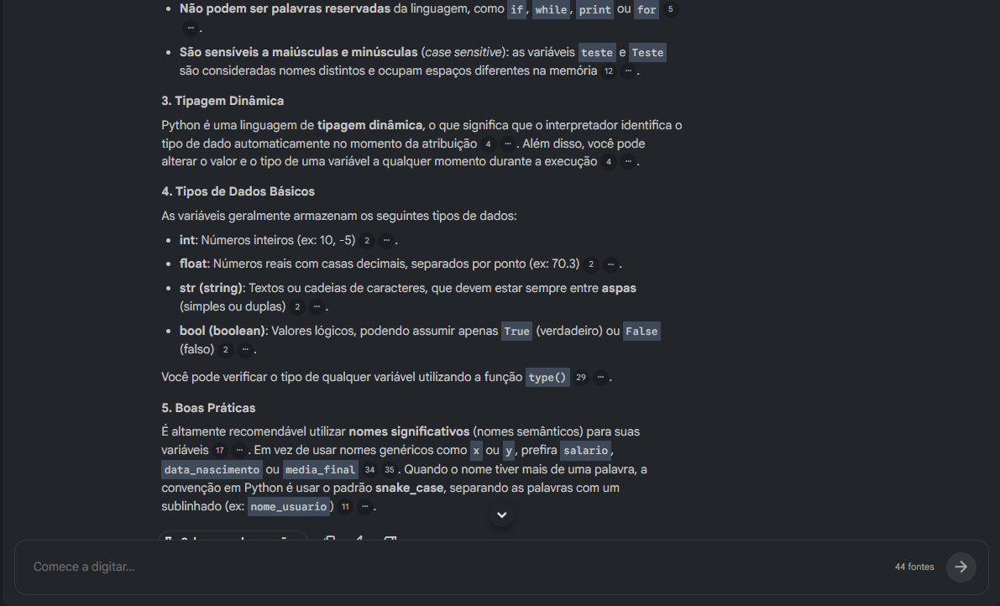

---

# Estrutura do Repositório

```text
python-brain-notebooklm/
│
├── README.md
│
├── docs/
│   ├── engenharia-prompts.md
│   ├── glossario-python.md
│   ├── plano-estudos-30-dias.md
│   └── quiz-python.md
│
├── fontes/
│   ├── links.md
│   ├── Apostila_Python_v1.pdf
│   ├── Ebook_Python_Avancado.pdf
│   ├── Introducao_Python_IFRN.pdf
│   ├── Guia_Mochileiro_Python.pdf
│   └── demais materiais utilizados
│
└── imagens/
    ├── tela_inicial.png
    ├── fontes1.png
    ├── fontes2.png
    ├── fontes3.png
    ├── fontes4.png
    ├── fontes5.png
    ├── fontes6.png
    ├── mapa_mental.png
    ├── prompt_erro_codigo.png
    ├── resposta_erro_codigo.png
    ├── teste_1-D-2.png
    └── teste_2-D-2.png
```

---

# Conclusão

O NotebookLM demonstrou ser uma ferramenta extremamente eficiente para organização do conhecimento, geração de materiais de estudo e apoio ao aprendizado de programação.

A utilização da Engenharia de Prompts permitiu obter respostas mais completas, contextualizadas e personalizadas, transformando o ambiente em um verdadeiro segundo cérebro para estudos de Python.

Além de consolidar conhecimentos técnicos da linguagem, o projeto proporcionou experiência prática com curadoria de conteúdo, documentação técnica, aprendizagem assistida por IA e organização de conhecimento, competências cada vez mais valorizadas no mercado de tecnologia.
